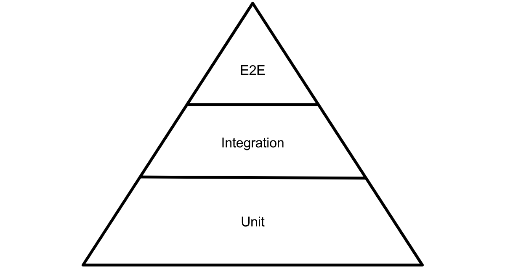

# Workflow

## Questions

* To **PM**: Are there any “hidden” requirements, or do we want to implement exactly the things listed by the user stories (e. g., no implied filtering or pagination)?
* To **PM**: How do we want to store data? I made an assumption that I am also responsible for persistence and choosing the correct db (no mention about it in the reqs).
* To **Dan / other devs**: What date format do you want to consume?
* To **PM**: Can we add a zombie that has items already?
~~Assuming no, since each item has price, so it makes little sense.~~
Actually, it makes sense, just “purchase” the items that a given zombie should have. *Added to plans.*
* To **PM**: If so, what should happen when adding a zombie with more than 5 items? Stripe items or just don’t accept the request?
Assuming the latter - 500 should be received and no zombie created. *Added to plans.*
* To **PM** / **other devs**: How do we want to handle payment, exactly? Assuming I should just create a placeholder and that is what I did.
* To **PM / other devs / other collaborators / architect**: Do we want user-friendly slugs or simple numerical `id`s? Assuming the latter (as one can see it's the same with external item API)
* To **PM** (**critical**): What is the base currency (assuming that we use integers, so that we can represent grosze, cents or eurocents exactly, as opposed to keeping it in a floating point number)?
Assuming zlotys.
* To **PM** (**critical**): Do we allow adding duplicated items (critical)?
If so, we might need to differentiate ids (id + externalId) - in this case we might want to treat “identical” (same externalId, “prefab”) items as separate, unique items (different internal id)
Assuming … (?)c (same id used internally and externally).
* To **Dan / Architect**: What HTTP code do you want for “quota exceeded”? There is no well-defined approach in REST / HTTP, although there is some consensus for 403 Forbidden (apart from using it, when a request is unauthorized).
Using that.
* To **PM / Architect**: Do we want to also include items implicitly when responding with a given Zombie? That is, to get:
```
{
  name: "Arthur"

  ...

  items: [
    ...,
    ...
  ]
}
```
* To **PM / Architect**: Similarly, do we want to include some reference to zombie in an item response? Assuming yes, so I based my RO on the suggestion from the following document:
https://cloud.google.com/blog/products/application-development/api-design-why-you-should-use-links-not-keys-to-represent-relationships-in-apis

## Design and implementation decisions

### Framework and dependencies

**Nest** framework alongside with some standard tooling was used. This implies TypeScript as a base programming language, which ensures additional level of safety due to strong typing.

It was quite a tough decision which database to use. Taking that into account, the persistence layer was implemented with the **TypeORM** mapping library. It adds additional layer of abstraction and so, if the actual database is to be changed in the future, a minimal amount of code will need to be modified.

The actual underlying database is **Postgres** due to several reasons:
* It is offered in the free Heroku app hosting plans without further costs,
* It plays well with TypeORM,
* It ensures id enumeration.

Also, validation and transformation mechanisms provided by Nest and the `class-validator` library were used to check, for example, whether the requested object has fields as described by DTOs, whether fields are of a given type or whether strings or arrays have specific number. Simple Nest pipes were used to transform stringified ids into numbers.

Looking at dependency diagram of @Nest-flavoured modules you can gain some general overview of how different parts of the app are connected:


### Architecture

Best practices and the layered architecture was used to make the project mantainable.

The whole project was at first divided into **modules**. They are representing features (like zombie or item) or some auxiliary units (like currency or item purchase modules).

Each module consists of:
* **Module file** describing this module,
* **Controller file(s)** (*optional*) for exposing REST endpoints,
* **Service file(s)** for performing some business logic related to given module,
* **Repository file(s)** (*optional*) for accessing the persisted data,
* **Entity file(s)** (*optional*) for describing the object-relational mapping of a given entity. These are used as a default domain objects also (no more interfaces or classes were extracted due to simplicity of the project),
* **DTOs** (*optional*) for defining the data received from the client. These are intentionally actual classes (as opposed to interfaces), since we want to be able to perform **runtime** validation.
* **Response objects** (*optional*) for defining and/or bulding (see `fromItemEntity()`) the data sent back to the client.
* **Models** (*optional*) for defining various data to work with, related to the given module (i. e. responses from external APIs).


This is reflected by the directory structure:

```
Root project directory
|
|- /src
|   |
|   |- /feature-a
|   |  | 
|   |  |- feature-a.module.ts
|   |  |- feature-a.controller.ts
|   |  |- feature-a.service.ts
|   |  |- feature-a.entity.ts
|   |  |- feature-a.repository.ts
|   |  | 
|   |  |- /dto    (contains different possible DTOs for feature-a)
|   |  |- /ro     (contains different possible ROs for feature-a)
|   |  |- /models (contains interfaces that describe related data)
|   |  | 
|   |  |- feature-a.module.unit.test.ts      (for module - placeholder)
|   |  |- feature-a.unit.test.ts             (for controller, service and entity)
|   |  |- feature-a.repository.unit.test.ts  (for repository)
|   |
|   |- /feature-b
|   |  | 
|   |  |- feature-b.module.ts
|   |  |- feature-b.controller.ts
|   |  |- feature-b.service.ts
|   |  |- feature-b.entity.ts
|   |  |- feature-b.repository.ts
|   |  | 
|   |  |- /dto    (contains different possible DTOs for feature-b)
|   |  |- /ro     (contains different possible ROs for feature-b)
|   |  |- /models (contains interfaces that describe related data)
|   |  | 
|   |  |- feature-b.module.unit.test.ts      (for module - placeholder)
|   |  |- feature-b.unit.test.ts             (for controller, service and entity)
|   |  |- feature-b.repository.unit.test.ts  (for repository)
|   |
|   |- /feature-...
|   .
|   .
|   .
|   |- (Others, i. e. app module files, entry point file, config directory)
.
.
.
|- /... (Other directories)
|- (Other files related to dependencies or configuration)


```

### Testing

#### Unit tests

Sticking to the **test pyramid**, unit test were concerned the most important ones with the aim of high coverage of the final project.



Ideally, the aim was to build the app with the TDD approach. Unfortunately, after some trials, this turned out to be a little bit cumbersome in this case. Still, whenever feasible and practical, this methodology should be used.

However, the code was parted into separate layers and further well-grained (when it comes to methods) and so is quite well-testable.

For more information concerning unit testing, see [`README` concerning unit testing](../test/unit/README.md).

The unit test coverage of 98.09% has been achieved:


The uncovered code is related to callbacks in library decorators (`typeorm`), which is quite tricky to cover - and probably not really necessary.

#### Integration tests and E2E tests

The initial aim was to have automated tests that would test the API with HTTP calls. This is without doubt an essential issue. Due to the lack of time, though, it was postponed and put into the plans, with focus on unit tests, which are even more important.

## Optimization

Some simple optimization steps were added:

* Due to the fact that we pay for every request, the endpoint POST for adding an entire item collection (list) was added. Although it does not adhere to REST best practices, it is the practice which wins in this case.
* Currency tables are retrieved only once and then cached to prevent the administrator from losing bandwidth by performing unnecessary API calls.

## Plans, improvements

I prioritized the things I would like to finalize if I had more time in three categories:

### Urgent

* **Make Currency Service refresh rates periodically (i. e. around ~ 00:00).**
* **Add endpoint for gettin a single item** (somehow forgot about it).
* Make sure or implement handling requests in an expected way (HTTP code 500) when the external APIs are not responding (NBP or Zombie Store)
* Include `items` or `items`-*ref* in the response object, similarly to the one concerning zombies.
* (*Product quality*) Add tests for higher levels - integration testing, e2e testing with **real HTTP calls**. Potentially Cucumber tests so product owners could browse requirements with ease and comfort. 
* (*Development environment*) Examine why test suites sometimes take several seconds to run (maybe there is some issue with Nest's Testing module - the tests themselves all seems to be fast, taking several miliseconds each). It should be really quick to make development efficent.

### Potential

* Allow purchasing items alongside with zombie creation (that is, by performing a single `POST` request) by letting the client include `externalIds` in the request.
* Make the app well-logged. Nest also encourages loggers’ encapsulation. Another approach: AOP → separation of concerns.
* (?) Wouldn't it better to have `features/` and `shared/` directorie for zombie/item and item-purchase/currency modules, respectively?

### Nice-to-have (CoH)

* If we would like to have a more REST-compliant API, we could consider adding navigation links in responses / stick to HATEOAS - if only it would bring some value and be worth money to implement (consider potential pros).
* Should we consider XMLs? Probably Nest makes its generation lot easier.
*  Pagination, filtering, etc. - could be possibly (in the future?) required by our business needs.

